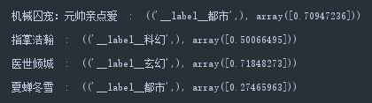

通过小说名字判断小说类型
===

通过`FastText`来进行文本分类

使用爬虫爬取了小说网站的收藏榜（因为此榜单人气高），扔到`FastText`里去训练。

同时使用 `jieba` 分词库来提高准确率。

## 网站爬虫

- 起点（男频）
- 创世（男频）
- 晋江（女频）
- 笔趣阁（综合）

起点、创世爬的都是收藏榜，长期人气高。

爬虫代码（以起点玄幻为例）：

```python
full_lines = []  # 结果的每一行


# 获取网页源码
def get_html(url):
    headers = {
        'User-Agent': 'User-Agent:Mozilla/5.0 (Macintosh; Intel Mac OS X 10_12_3) AppleWebKit/537.36 (KHTML, like Gecko) Chrome/56.0.2924.87 Safari/537.36'}
    req = urllib.request.Request(url=url, headers=headers)
    html = urllib.request.urlopen(req)
    return html.read().decode('utf-8', 'ignore')


# 保存到文本文件
def save_text_file(file_name, contents):
    with open(file_name, 'w', encoding='utf-8') as f:
        f.write(contents)


# 提取起点每一个类型的书名数组
def add_qidian_novel_type(type_id, type_name):
    global full_lines
    for page in range(1, 25):  # 遍历每一页
        html = get_html("https://www.qidian.com/rank/collect?chn=" + type_id + "&page=" + str(page))
        names = re.findall(
            '<h4><a href="//book.qidian.com/info/\\d+" target="_blank" data-eid="qd_C40" data-bid="\\d+">(.+?)</a></h4>'
            , html)
        print(type_name, "(", str(page), ") : ", len(full_lines), " : ", names)
        for name in names:
            full_lines += ["__label__" + type_name + " " + " ".join(jieba.cut(name))]

add_qidian_novel_type("21", "玄幻")
add_qidian_novel_type("1", "玄幻")  # 奇幻
add_qidian_novel_type("2", "武侠")
add_qidian_novel_type("22", "修真")  # 仙侠
add_qidian_novel_type("4", "都市")  # 言情？
add_qidian_novel_type("15", "现实")
add_qidian_novel_type("6", "军事")
add_qidian_novel_type("5", "历史")
add_qidian_novel_type("7", "游戏")
add_qidian_novel_type("8", "体育")
add_qidian_novel_type("9", "科幻")
add_qidian_novel_type("10", "灵异")
add_qidian_novel_type("12", "二次元")

random.shuffle(full_lines)  # 随机打乱顺序
fulltext = "\n".join(full_lines)  # 组成字符串
save_text_file('data/qidian_names.txt', fulltext)  # 保存到文件
```

其中晋江用的是本地，因为那个排行榜不分页，而且用上面的代码获取过来会乱码（试了几个编码照样乱码），就存到本地再读取了。

笔趣阁有一部分页面会乱码，只能获取一部分，但是数量是真的多。


## 神经网络训练

网上说的那些词向量什么的我也不懂，一堆语料库扔进去训练就是了。

调整了一下几个参数，不知道准确性如何。

```python
import fastText
import jieba


# 判断小说类型的调用语句
def judge(novel):
    print(novel, " : ", classifier.predict(" ".join(jieba.cut(novel))))


# 保存到文本文件
def save_text_file(file_name, contents):
    with open(file_name, 'w', encoding='utf-8') as f:
        f.write(contents)


# 判断哪些素材要进行训练
sources = ['biquge', 'qidian', 'chuangshi', 'jinjiang']
fulltext = ""
for source in sources:
    fulltext += open("data/"+source+"_names.txt", encoding='utf-8').read() + "\n"
save_text_file("data/novel_names.txt", fulltext)


classifier = fastText.train_supervised("data/novel_names.txt", lr=0.1, wordNgrams=1, loss="hs")
model = classifier.save_model("data/novel_names.model")
# classifier = fastText.load_model("data/novel_names.model")


judge("机械囚宠：元帅亲点爱")
judge("指掌浩瀚")
judge("医世倾城")
judge("夏蝉冬雪")

```


## 运行示例

```python
judge("机械囚宠：元帅亲点爱")
judge("指掌浩瀚")
judge("医世倾城")
judge("夏蝉冬雪")
```




